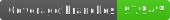

# Malwoden - Alpha




Malwoden is a roguelike library, meant to perform much of the heavy lifting when creating roguelike games. It takes inspiration from [rot-js](https://ondras.github.io/rot.js/hp), as well as [bracket-lib](https://github.com/thebracket/bracket-lib). ROT still has a number of features we're still building towards, so feel free to take the best parts from each library.

One of the main goals of this library is to provide a simple, minimalistic `Terminal` package with great support for CP437 tilesets.
This is one area I've found lacking, and hope this library can provide a solid framework for roguelikes and text based games.
The core of the terminal package is based heavily on Bob Nystrom's amazing [malison](https://github.com/munificent/malison) Dart library.

If you're looking for graphics outside basic ASCII/CP437, [phaser](https://phaser.io/) and [pixi](https://www.pixijs.com/) are both worth checking out.

## Alpha

This library is still in alpha. While many of the features are working well, the api is not fully finalized yet. We welcome any feedback on the design and implementation so far, and hope to launch a public beta early 2021.

## Installation

Malwoden can be downloaded via npm:

```sh
# For stable
npm install malwoden

# For dev builds
npm install malwoden@next
```

If developing malwoden locally, you can use `npm link` to easily use it in another project.

```sh
# Inside the malwoden project
npm run start
npm link

# Inside another project
npm link malwoden
```

## Modules

- FOV - Field of View Algorithms
- Generation - General Map Creation
- GUI - Useful UI Widgets
- Input - Keyboard + Mouse Abstractions
- Calc - Helpful Math Functions
- Pathfinding - Pathfinding Implementations
- Rand - Seedable RNG
- Terminal - Draw Fonts or Tilesets
- Util - Misc Structs + Functions
